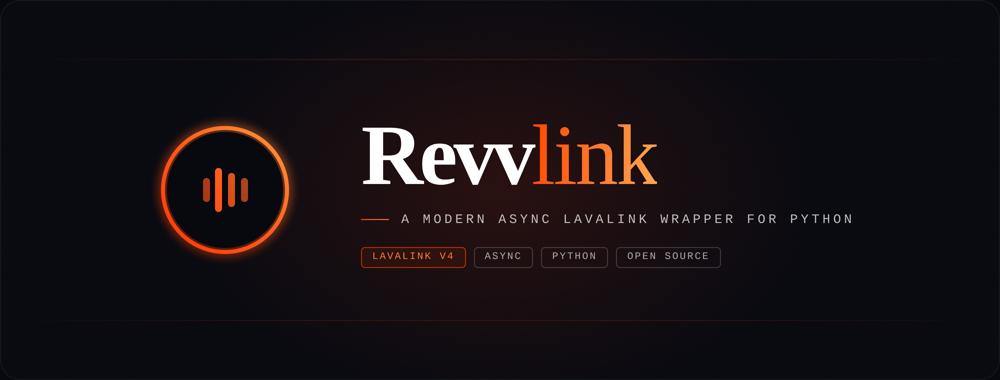
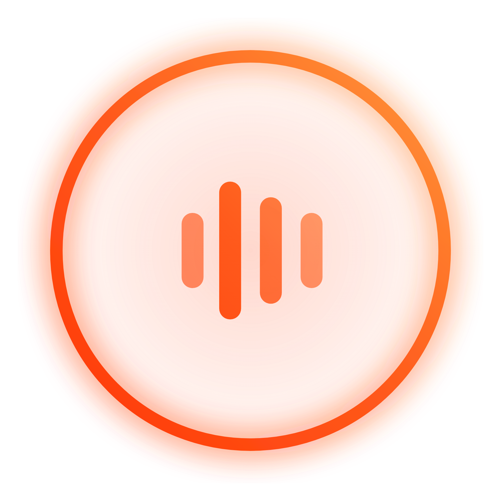
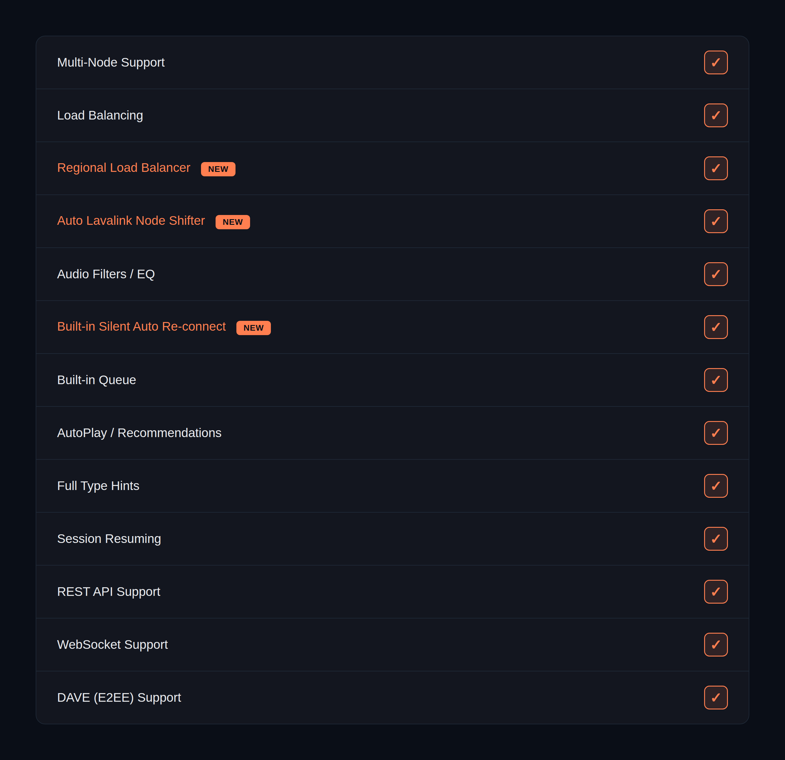
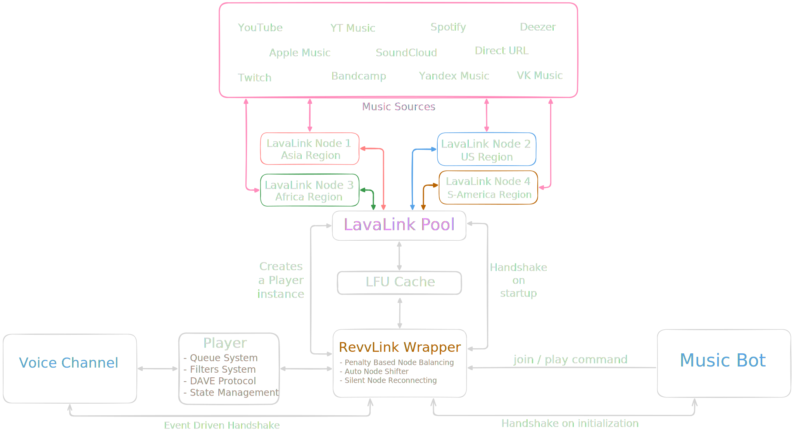

# RevvLink

<div align="center">
  
  
  <h3>The Definitive Lavalink Wrapper for Python</h3>

  <p align="center">
    <a href="https://pypi.org/project/revvlink/"></a>
    <a href="https://pypi.org/project/revvlink/"></a>
    <a href="LICENSE"></a>
    
  </p>
  
  <p align="center">
    <a href="https://lavalink.dev"></a>
    
  </p>

  <p align="center">
    <a href="https://github.com/ded-lmfao/RevvLink/actions/workflows/version_checks.yml"></a>
    <a href="https://github.com/ded-lmfao/RevvLink/actions/workflows/version_checks.yml"></a>
    <a href="https://github.com/ded-lmfao/RevvLink/actions/workflows/version_checks.yml"></a>
    <a href="https://github.com/ded-lmfao/RevvLink/actions/workflows/version_checks.yml"></a>
  </p>

  <p align="center">
    <a href="https://sonar.is-papa.fun/dashboard?id=RevvLink"></a>
    <a href="https://sonar.is-papa.fun/dashboard?id=RevvLink"></a>
    <a href="https://sonar.is-papa.fun/project/issues?id=RevvLink&resolved=false&types=BUG"></a>
    <a href="https://sonar.is-papa.fun/project/issues?id=RevvLink&resolved=false&types=VULNERABILITY"></a>
    <a href="https://sonar.is-papa.fun/project/issues?id=RevvLink&resolved=false&types=CODE_SMELL"></a>
  </p>
</div>

---


**RevvLink** is a next-generation, high-performance Lavalink wrapper built specifically for modern Discord bot development in Python. Engineered with versatility and scale in mind, RevvLink offers a professional-grade API that makes audio integration seamless and powerful. Inspired by Wavelink.

---

##  Table of Contents
- [Table of Contents](#table-of-contents)
- [Why RevvLink?](#why-revvlink)
- [Features](#features)
- [Architecture](#architecture--flow)
- [Installation](#installation)
- [Quickstart](#quickstart)
- [Examples](#examples)
- [Contributing](#contributing)
- [License](#license)

---

###  Why RevvLink?

<table border="0">
  <tr>
    <td width="52" valign="middle"></td>
    <td valign="middle"><strong>Extreme Performance</strong>: Built on top of a fully asynchronous architecture, RevvLink handles heavy loads with minimal overhead.</td>
  </tr>
  <tr>
    <td width="52" valign="middle"></td>
    <td valign="middle"><strong>State-of-the-Art Logic</strong>: Features advanced regional load balancing, penalty-based node selection, and intelligent failover migration.</td>
  </tr>
  <tr>
    <td width="52" valign="middle"></td>
    <td valign="middle"><strong>Enterprise Queue System</strong>: Robust queue management with support for custom storage backends and deep manipulation APIs.</td>
  </tr>
  <tr>
    <td width="52" valign="middle"></td>
    <td valign="middle"><strong>Modern Standards</strong>: Fully compatible with Lavalink v4.0+, including native support for the DAVE E2EE protocol and specialized plugins like LavaSrc.</td>
  </tr>
  <tr>
    <td width="52" valign="middle"></td>
    <td valign="middle"><strong>Strictly Typed</strong>: Developed with Pyright strict compliance to ensure your code is bug-free and easy to maintain.</td>
  </tr>
</table>

---
###  Features
<div align="center">
  
</div>

---

###  Architecture & Flow

<div align="center">
  <a href="assets/FlowChart.svg"></a>
</div>

---

###  Installation

RevvLink requires **Python 3.10+**.

```bash
# Stable version from PyPI
pip install revvlink
```

For the latest development version:
```bash
pip install git+https://github.com/ded-lmfao/RevvLink.git
```

---

###  Quickstart

Here is a minimal example of how to get up and running with RevvLink.

```python
import discord
from discord.ext import commands
import revvlink

class Bot(commands.Bot):
    def __init__(self) -> None:
        super().__init__(command_prefix="!", intents=discord.Intents.all())

    async def setup_hook(self) -> None:
        # Connect to your Lavalink nodes
        nodes = [revvlink.Node(uri="http://localhost:2333", password="youshallnotpass")]
        await revvlink.Pool.connect(nodes=nodes, client=self)

bot = Bot()

@bot.command()
async def play(ctx: commands.Context, *, query: str) -> None:
    if not ctx.voice_client:
        vc: revvlink.Player = await ctx.author.voice.channel.connect(cls=revvlink.Player)
    else:
        vc: revvlink.Player = ctx.voice_client

    tracks = await revvlink.Playable.search(query)
    if not tracks:
        return await ctx.send("No tracks found.")

    track = tracks[0]
    await vc.play(track)
    await ctx.send(f"Now playing: {track.title}")

bot.run("YOUR_TOKEN")
```

---

###  Examples

Check the [examples](https://github.com/ded-lmfao/RevvLink/tree/main/examples) directory for advanced usage, including:
- Custom Queue Handlers
- Advanced Filters (Nightcore, etc.)
- Regional Load Balancing Configuration
- AutoPlay and Recommendation Systems

---

###  Development

To run the codebase locally and ensure everything is passing:

```bash
# Install development dependencies
pip install -e ".[dev]"

# Run Linting and Formatting checks
ruff check .
ruff format --check .

# Run Type Checking
pyright

# Run Tests
pytest
```

---

###  Contributing

We welcome contributions! If you'd like to help improve RevvLink:
1. Fork the repository.
2. Create a new branch (`git checkout -b feature/amazing-feature`).
3. Commit your changes (`git commit -m 'Add some amazing feature'`).
4. Push to the branch (`git push origin feature/amazing-feature`).
5. Open a Pull Request.

Please ensure your code follows our [Ruff](https://github.com/astral-sh/ruff) and [Pyright](https://github.com/microsoft/pyright) configurations.

---

<table border="0">
  <tr>
    <td width="52" valign="middle"></td>
    <td valign="middle"><strong>Official Docs</strong>: Coming soon!</td>
  </tr>
  <tr>
    <td width="52" valign="middle"></td>
    <td valign="middle"><strong>Community</strong>: Support Server coming soon!</td>
  </tr>
</table>

---

###  Credits

- [Wavelink](https://github.com/PythonistaGuild/Wavelink) for the architectural inspiration.
- [Lavalink](https://github.com/lavalink-devs/Lavalink) for the amazing audio server.

---

###  License

RevvLink is released under the MIT License. See [LICENSE](LICENSE) for more information.
